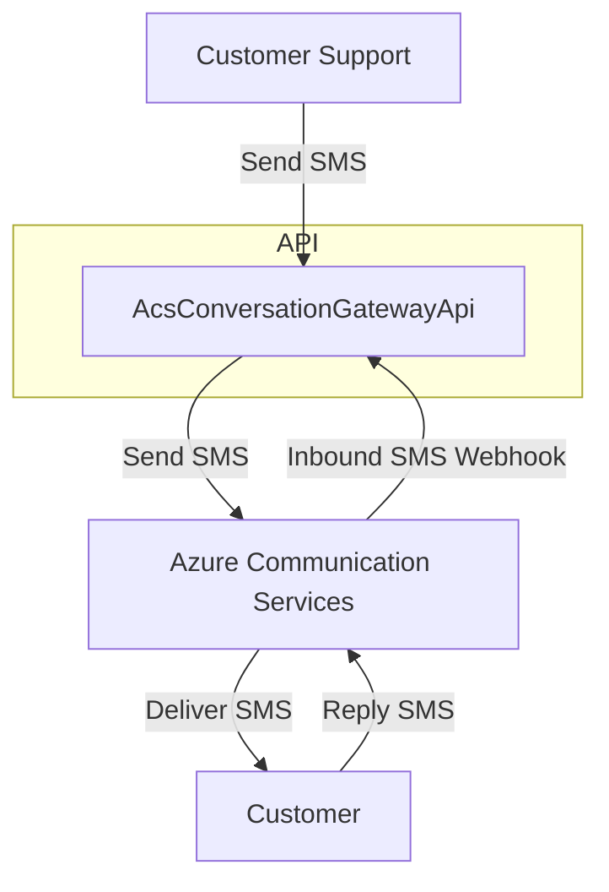
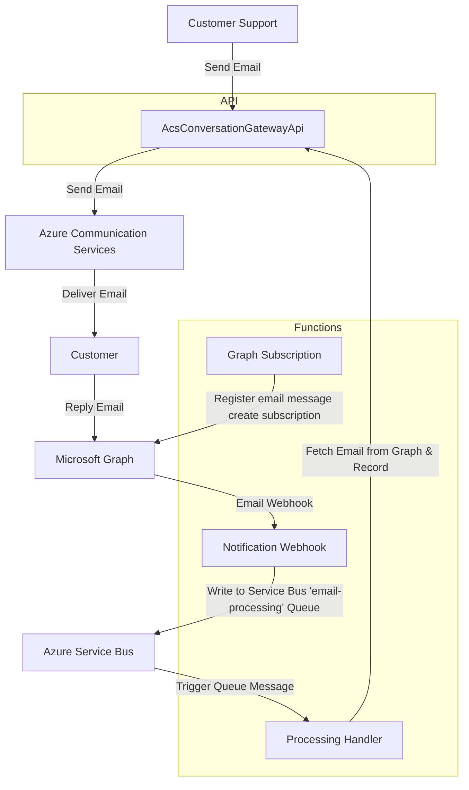
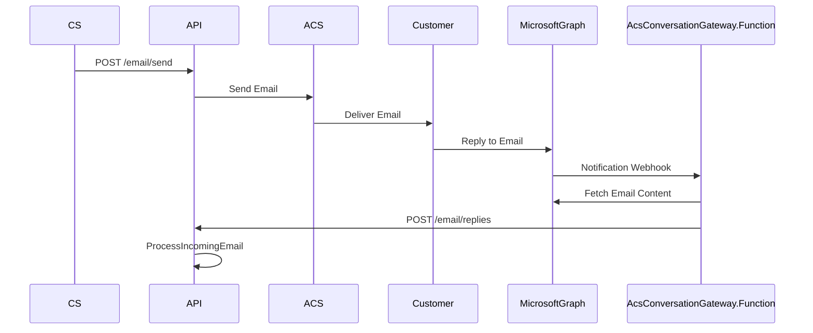
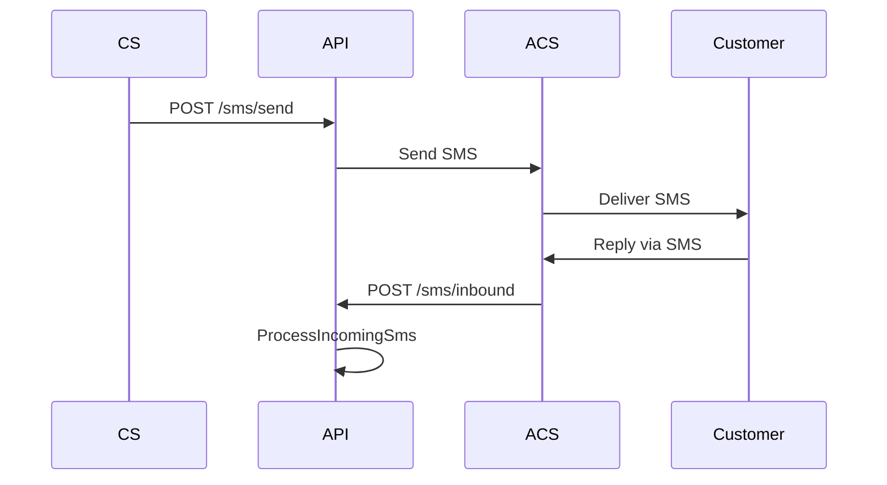

# AcsConversationGateway

> Omnichannel customer conversations with Azure Communication Services (ACS) — supporting SMS and Email, built with .NET 9.

---

## Overview

AcsConversationGateway is a modern .NET 9 solution for managing customer conversations across SMS and Email channels. It leverages Azure Communication Services (ACS) and Microsoft Graph to provide seamless, reliable, and scalable communication between customers and service agents.

- **AcsConversationGatewayApi**: ASP.NET Core Web API for sending/receiving SMS and Email, and tracking conversation history.
- **AcsConversationGateway.Function**: Azure Functions for processing inbound email notifications from Microsoft Graph and relaying them to the API.

---

## Features

- 📧 **Email & SMS Support**: Send and receive messages via ACS.
- 🔄 **Omnichannel Conversation History**: Unified tracking of all customer interactions.
- ⚡ **Real-time Inbound Processing**: Webhooks and Azure Functions for instant message delivery.
- 🔒 **Secure Integration**: Works with Microsoft Graph and ACS using best practices.

---

## Architecture

### SMS Workflow



### Email Workflow

---

## Communication Flows

### Email



### SMS



---

## Prerequisites

Before you begin, ensure you have:

- [.NET 9 SDK](https://dotnet.microsoft.com/download)
- [Azure CLI](https://docs.microsoft.com/en-us/cli/azure/install-azure-cli) (optional, for setup)
- [Azure Functions Core Tools](https://docs.microsoft.com/en-us/azure/azure-functions/functions-run-local#install-the-azure-functions-core-tools)
- An active Azure subscription
- A Microsoft 365 account with Exchange Online
- A custom domain for email (recommended for production)

---

## Complete Setup Guide

### Step 1: Azure Communication Services Setup

#### 1.1 Create Azure Communication Services Resource

1. **Azure Portal Setup:**
   ```bash
   # Using Azure CLI (alternative to portal)
   az communication create \
     --name "your-acs-resource-name" \
     --resource-group "your-resource-group" \
     --location "East US"
   ```

2. **Get Connection String:**
   - Navigate to Azure Portal → Your ACS Resource → Keys
   - Copy the **Connection String** (save for later)

#### 1.2 Setup SMS Capability

1. **Purchase Phone Number:**
   - Go to ACS Resource → Phone Numbers → Get
   - Select your country and number type
   - Choose a phone number with SMS capabilities
   - Complete the purchase

2. **Configure SMS Webhook (Optional):**
   - Go to ACS Resource → Events
   - Create Event Subscription for SMS events
   - Set webhook URL to: `https://your-api-domain.com/sms/inbound`

#### 1.3 Setup Email Capability

1. **Create Email Communication Service:**
   ```bash
   # Create Email Communication Service
   az communication email create \
     --name "your-email-service-name" \
     --resource-group "your-resource-group" \
     --location "Global"
   ```

2. **Setup Custom Domain (Recommended):**
   - Navigate to Email Communication Service → Domains
   - Click "Add Domain" → "Custom Domain"
   - Enter your domain (e.g., `yourdomain.com`)
   - Follow DNS verification steps:
     - Add TXT record for domain verification
     - Add CNAME records for DKIM
     - Add MX records if using for inbound email

3. **Verify Domain:**
   - Wait for DNS propagation (can take up to 24 hours)
   - Click "Verify" in the Azure portal
   - Ensure all verification checks pass

4. **Connect Email Service to ACS:**
   - Go to your ACS Resource → Email → Domains
   - Click "Connect Domain"
   - Select your Email Communication Service and domain

### Step 2: Microsoft Graph API Setup

#### 2.1 Register Azure AD Application

1. **Create App Registration:**
   - Azure Portal → Azure Active Directory → App Registrations → New Registration
   - Name: `AcsConversationGateway-GraphAPI`
   - Supported account types: Choose based on your needs
   - Redirect URI: Leave blank for now

2. **Configure API Permissions:**
   - Go to API Permissions → Add Permission → Microsoft Graph → Application Permissions
   - Add these permissions:
     - `Mail.Read` - Read mail in all mailboxes
     - `Mail.ReadWrite` - Read and write mail in all mailboxes
     - `MailBoxSettings.Read` - Read mailbox settings
     - `User.Read.All` - Read all users' profiles
   - Click "Grant admin consent"

3. **Create Client Secret:**
   - Go to Certificates & Secrets → New Client Secret
   - Description: `AcsConversationGateway-Secret`
   - Expires: Choose appropriate duration
   - **Save the secret value immediately** (you won't see it again)

4. **Note Required Values:**
   - Application (client) ID
   - Directory (tenant) ID
   - Client secret value

### Step 3: Azure Service Bus Setup

#### 3.1 Create Service Bus Namespace

1. **Create Service Bus:**
   ```bash
   az servicebus namespace create \
     --name "your-servicebus-namespace" \
     --resource-group "your-resource-group" \
     --location "East US" \
     --sku Standard
   ```

2. **Create Queue:**
   ```bash
   az servicebus queue create \
     --name "email-processing" \
     --namespace-name "your-servicebus-namespace" \
     --resource-group "your-resource-group"
   ```

3. **Get Connection String:**
   ```bash
   az servicebus namespace authorization-rule keys list \
     --resource-group "your-resource-group" \
     --namespace-name "your-servicebus-namespace" \
     --name RootManageSharedAccessKey
   ```

### Step 4: Configure Application Settings

#### 4.1 AcsConversationGatewayApi Configuration

Create or update `src/AcsConversationGatewayApi/appsettings.Development.json`:

```json
{
  "Logging": {
    "LogLevel": {
      "Default": "Information",
      "Microsoft.AspNetCore": "Warning"
    }
  },
  "AzureCommunicationService": {
    "ConnectionString": "endpoint=https://your-acs-resource.communication.azure.com/;accesskey=YOUR_ACCESS_KEY",
    "PhoneNumber": "+1234567890",
    "FromEmail": "noreply@yourdomain.com",
    "ReplyToEmail": "support@yourdomain.com"
  },
  "FeatureFlags": {
    "MockEmail": false,
    "MockSms": false
  }
}
```

#### 4.2 Azure Functions Configuration

Create or update `src/AcsConversationGateway.Function/local.settings.json`:

```json
{
  "IsEncrypted": false,
  "Values": {
    "AzureWebJobsStorage": "UseDevelopmentStorage=true",
    "FUNCTIONS_WORKER_RUNTIME": "dotnet-isolated",

    "InternalApiUrl": "https://localhost:7195",
    "NotificationUrl": "https://your-function-app.azurewebsites.net/api/notifications",
    "TargetUserId": "user@yourdomain.com",
    "ClientState": "35C5388E-7608-4B7F-B0EE-D142FB5D35FB",

    "Graph:ClientId": "your-app-client-id",
    "Graph:ClientSecret": "your-app-client-secret",
    "Graph:TenantId": "your-tenant-id",

    "ServiceBusConnectionString": "Endpoint=sb://your-servicebus-namespace.servicebus.windows.net/;SharedAccessKeyName=RootManageSharedAccessKey;SharedAccessKey=YOUR_KEY",
    "EmailProcessingQueueName": "email-processing"
  }
}
```

### Step 5: Environment-Specific Configuration

#### 5.1 For Development
- Use the `local.settings.json` and `appsettings.Development.json` files above
- Ensure `MockSms: true` for testing without actual SMS charges
- Use Azure Storage Emulator or Azurite for local development

#### 5.2 For Production
- Store sensitive settings in Azure Key Vault or Azure App Configuration
- Update Azure Function App Configuration with production values
- Set up proper monitoring and logging
- Configure custom domains and SSL certificates

### Step 6: Configuration Checklist

Before running the application, ensure you have configured:

**Azure Communication Services:**
- ✅ ACS Connection String
- ✅ SMS Phone Number (if using SMS)
- ✅ Verified email domain
- ✅ From Email Address
- ✅ Reply-To Email Address

**Microsoft Graph API:**
- ✅ Azure AD App Registration
- ✅ Client ID
- ✅ Client Secret
- ✅ Tenant ID
- ✅ Required API permissions granted
- ✅ Target user email for monitoring

**Azure Service Bus:**
- ✅ Service Bus Connection String
- ✅ Email processing queue created
- ✅ Appropriate access policies

**Application Settings:**
- ✅ All connection strings updated
- ✅ Feature flags configured appropriately
- ✅ Webhook URLs configured correctly

---

## Quickstart

> [!TIP]
> Complete the setup guide above before proceeding with the quickstart.

### 1. Clone the repository

```sh
git clone https://github.com/your-org/AcsConversationGateway.git
cd AcsConversationGateway
```

### 2. Restore dependencies

```sh
dotnet restore
```

### 3. Run locally

```sh
# Start the API
cd src/AcsConversationGatewayApi
dotnet run
```

```sh
# In a new terminal, start the Azure Function
cd src/AcsConversationGateway.Function
func start
```

### 4. Test the setup

Open your browser and navigate to:
- API: `https://localhost:7195/swagger` (if Swagger is configured)
- Use the provided `AcsConversationGatewayApi.http` file for testing endpoints

---

## Endpoints

| Method | Endpoint              | Description                                 |
|--------|----------------------|---------------------------------------------|
| GET    | `/customers`         | Get all customers                           |
| GET    | `/tickets`           | Get all support tickets                     |
| GET    | `/tickets?customerId={id}` | Get tickets for specific customer     |
| POST   | `/email/send`        | Send an email to a customer                 |
| POST   | `/email/inbound`     | Receive and process inbound email replies   |
| POST   | `/sms/send`          | Send an SMS to a customer                   |
| POST   | `/sms/inbound`       | Receive and process inbound SMS             |

---

## Troubleshooting

### Common Issues

**Email not sending:**
- Verify domain is properly configured and verified
- Check ACS connection string and from email address
- Ensure email domain has proper SPF/DKIM records

**SMS not working:**
- Verify phone number is SMS-enabled
- Check ACS connection string
- Ensure SMS feature flag is set correctly

**Graph API permissions:**
- Verify admin consent has been granted
- Check client secret hasn't expired
- Ensure correct tenant ID is configured

**Service Bus connection:**
- Verify connection string format
- Ensure queue exists
- Check access policies

---

## Configuration

- Set all secrets and connection strings in the appropriate configuration files.
- For email monitoring, configure Microsoft Graph subscriptions as described in the [official documentation](https://learn.microsoft.com/graph/webhooks).

---

## Feedback

> [!NOTE]
> For questions or suggestions, please open an issue or start a discussion.

---

Let me know if you want to further customize the diagrams or add more technical details!
